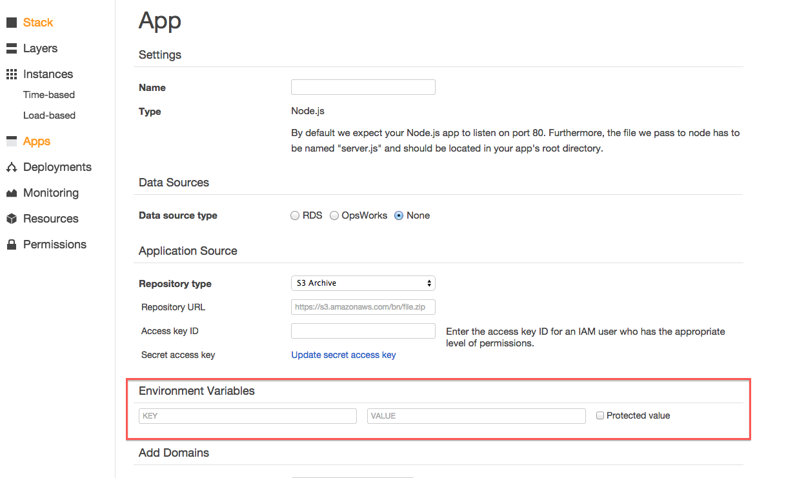

## Environments
We should provide three environments to suit our deployment and testing process

### Development
When working locally and developing.
This should point to local copies of all conected systems

### Staging
That final step, where the work can be tested before releasing to the wild.
This should point to staging versions of all conected systems

### Production
The real deal, everything live and in front of customers.
This should point to other productions systems

###Environment Switching
Each system should support the ability to select the environment it is running in, in the following order

- Command line argument, when starting the application
- Environment Variable (to be named **environment**)
- Defaulting to **Production**

###Supported Environment values
- development
- staging
- production

###Configuring on OpsWorks
When running inside of an **AWS OpsWorks** stack, this can be configured in the environment variables for the desired **App**  
